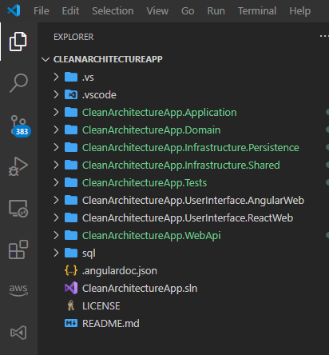
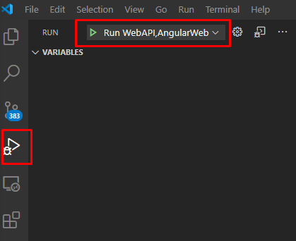
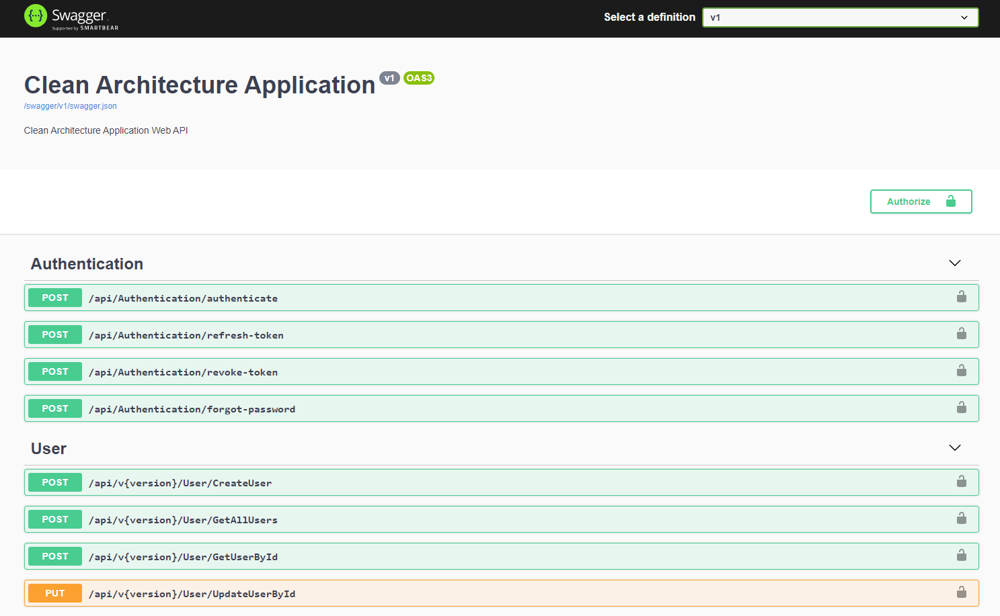
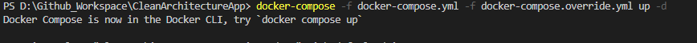
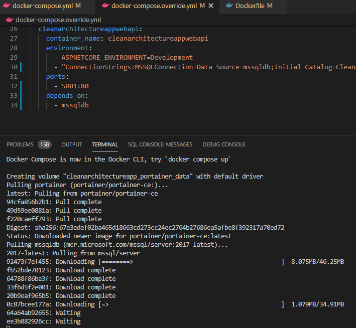
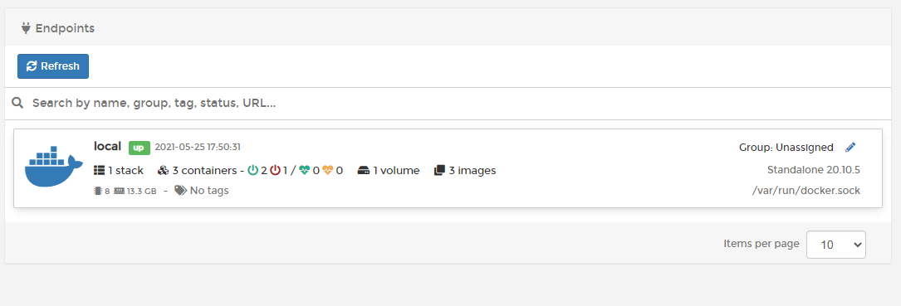
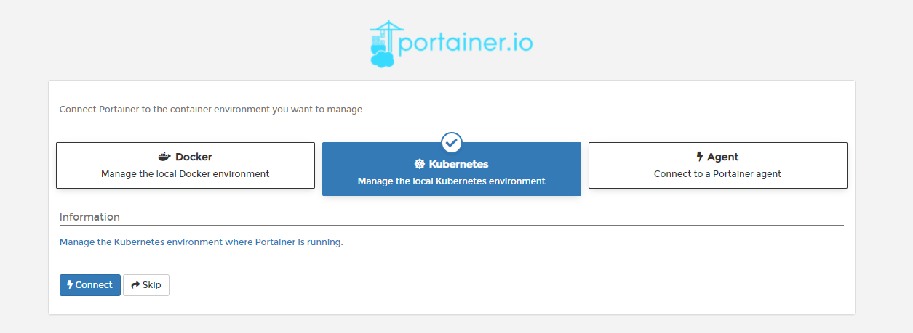
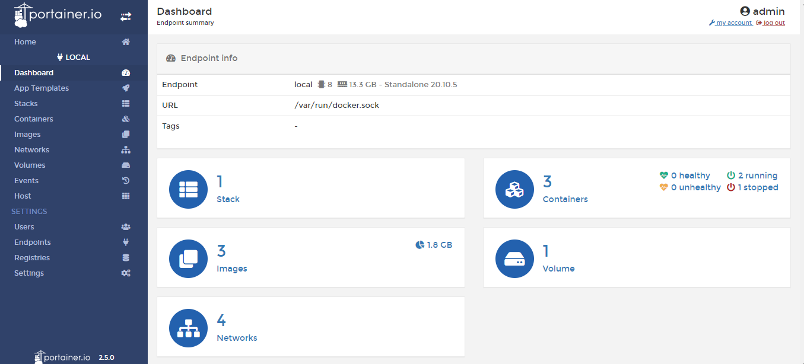

# CleanArchitectureApp
Clean Architecture Application Design from Scratch using Dotnet Core 5 WebApi and Angular 11 FrontEnd

[](http://opensource.org/licenses/MIT)

## Technologies
- [ASP.NET Core 5](https://dotnet.microsoft.com/)
- [NHibernate](https://nhibernate.info/)
- [Angular 11](https://angular.io/)
- [Angular CLI 11](https://cli.angular.io/)
- [Clean Architecture]()
- [Swashbuckle.AspNetCore.Swagger](https://github.com/domaindrivendev/Swashbuckle.AspNetCore)
- Design Pattern: Command Query Responsibility Segregation (CQRS)
- [Fluent Validation](https://fluentvalidation.net/)
- WebAPI Global Exception Middleware
- Login, Logout and Forgot Password using JWT tokens
- Microsoft Sql Server and Postgresql supported
- AWS Postgres RDS
- AWS Lambda
- AWS Systems Manager
- AWS Simple Storage Service (S3)
- [Docker](https://docs.docker.com/docker-for-windows/install/) 

## Pre-requisites
1. [.Net core 5 SDK](https://www.microsoft.com/net/core#windows)
2. [Visual studio 2019](https://www.visualstudio.com/) OR [VSCode](https://code.visualstudio.com/) with [C#](https://marketplace.visualstudio.com/items?itemName=ms-vscode.csharp) extension
3. [NodeJs](https://nodejs.org/en/) (Latest LTS)
4. [Microsoft SQL Server](https://www.microsoft.com/en-us/sql-server/sql-server-2017) (Optional: If MS SQL server required instead of Sqlite during development)
5. [POSTGRESQL](https://www.postgresql.org/download/)

## Configuration

1. Clone the repo: git clone  https://github.com/sunilkumarmedium/CleanArchitectureApp.git
2. Execute the sql scripts available in the folder `/sql/`
   - MSSQL use CleanArchitectureDB.sql
   - POSTGRES use CleanArchitectureDB-Postgres
3. Change the database connectionstring in appsettings.json
   - Path : CleanArchitectureApp.WebApi/appsettings.Development.json  or appsettings.json
   - `"DBProvider": "MSSQL" ,` Use `MSSQL` to connect to Microsoft SqlServer Or `POSTGRES` to connect to PostgreSQL database
   - `"ConnectionStrings": {
    "MSSQLConnection": "Data Source=DESKTOP-SUNILBO;Initial Catalog=CleanArchitectureDB;User ID=sa;Password=xxx;MultipleActiveResultSets=True",
    "PostgresConnection": "Server=127.0.0.1;Port=5432;Database=CleanArchitectureDB;User Id=postgres;Password=xxx;Timeout=30;TimeZone=UTC"
  }'
  `
4. cd to folder CleanArchitectureApp\CleanArchitectureApp.UserInterface.AngularWeb\ClientApp
   - `npm install`
5. open the CleanArchitectureApp.sln
   - Visual Studio 2019 IDE
      - opening the solution will restore the nuget and npm packages build the solution
      - Multiple Projects Startup `CleanArchitectureApp.WebApi` and `CleanArchitectureApp.UserInterface.AngularWeb`
   - Visual Studio Code
     - Open the folder `CleanArchitectureApp`
      
     - Build the Solution
     - Run the Projects `CleanArchitectureApp.WebApi` and `CleanArchitectureApp.UserInterface.AngularWeb`
	 
 6. Application URL's
	- `Webapi http://localhost:5001`
	
	- `AngularWeb http://localhost:5003`
	
	
 7. Test User to Login
    - `Username: system`
    - `Password: admin@123`

## Cloud Deployment


AWS Lambda Deployment, AWS RDS Instance Creation and Managing the database connectionstring using AWS Systems Manager

Read the below articles to get some understanding on the AWS RDS , Lambda and Systems Manager.

https://sunil-kumar-60226.medium.com/postgresql-database-instance-creation-and-configuration-in-aws-rds-9ac324cee7fc

https://sunil-kumar-60226.medium.com/aws-systems-manager-parameter-store-for-managing-configuration-and-retrieve-at-runtime-using-c-e5593752705c

https://sunil-kumar-60226.medium.com/build-a-serverless-dotnet-core-web-api-with-aws-lambda-and-api-gateway-4c670edd8747


Change the settings in appsettings.json  `IsCloudDeployment` `Region` `CloudSSMConnectionString` 
```
"IsCloudDeployment": "true",
  "Region": "ap-south-1",
  "DBProvider": "POSTGRES" ,
  "ConnectionStrings": {
    "MSSQLConnection": "Data Source=DESKTOP-SUNILBO;Initial Catalog=CleanArchitectureDB;User ID=sa;Password=admin@123;MultipleActiveResultSets=True",
    "PostgresConnection": "Server=127.0.0.1;Port=5432;Database=CleanArchitectureDB;User Id=postgres;Password=admin@123;Timeout=30;TimeZone=UTC",
    "CloudSSMConnectionString": "/CleanArchitectureAppWebApi/postgresconnection"
  },
```

## Docker Container Deployment
### Installing
Follow these steps to get your development environment: (Before Run Start the Docker Desktop)
1. Clone the repository
2. Once Docker for Windows is installed, go to the **Settings > Advanced option**, from the Docker icon in the system tray, to configure the minimum amount of memory and CPU like so:
* **Memory: 4 GB**
* CPU: 2
3. At the root directory which include **docker-compose.yml** files, run below command:
```csharp
docker-compose -f docker-compose.yml -f docker-compose.override.yml up -d
```


4. Launch Url's

* **CleanArchitectureApp API -> http://localhost:5001/swagger/index.html**
* **Portainer -> http://localhost:9000**   -- admin/admin@123


